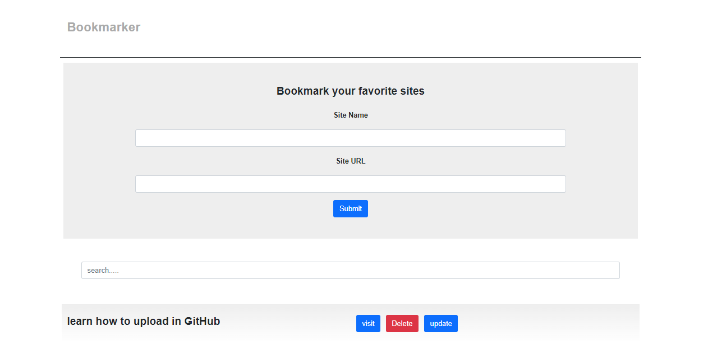

Bookmarker - project

It is a project that collects links to sites to be saved and returned to when needed
By saving links to websites and their names in local storage

* Done by HTML & CSS & bootstarp 5 & JavaScript & Local Storage 
* I used local storage to stor the data of users

The picture shows the page

